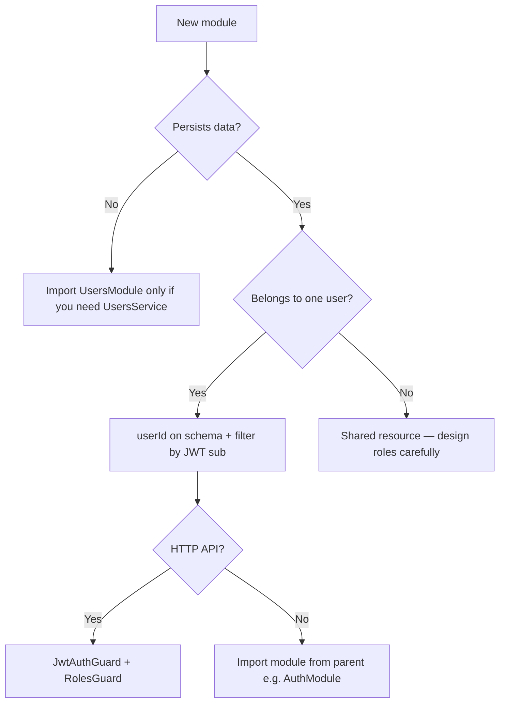

# Adding NestJS modules

This API uses **feature modules** under `src/<feature>/`. Each module owns its Mongoose schemas, services, DTOs, and (when needed) HTTP controllers. Wire new features in **`AppModule`** unless they are **internal helpers** consumed only by another module (like `sessions` inside `auth`).

Pair with **shadow-society-platform** when you add routes the web app will call: add API methods in `src/data/api/server/` and document the contract here in [`README.md`](./README.md).

## Module types in this API

| Type | HTTP controller? | Registered in | User link | Example |
|------|-------------------|---------------|-----------|---------|
| **App feature** | Yes | `AppModule.imports` | Often | `users`, future `projects` |
| **Nested feature** | Yes | `AppModule` + may import `UsersModule` | Often | New domain module |
| **Internal service** | No | Parent module only | Often | `sessions` (used by `auth`) |
| **Auth-adjacent** | Sometimes | `AuthModule` or `AppModule` | Yes | `user-api-tokens` |

## Folder layout (new feature)

```
src/<feature>/
├── <feature>.module.ts
├── <feature>.controller.ts      # omit if internal-only
├── <feature>.service.ts
├── dto/
│   ├── create-<feature>.dto.ts
│   └── update-<feature>.dto.ts
└── schemas/
    └── <feature>.schema.ts
```

## Rules of thumb

| Question | Guidance |
|----------|----------|
| **Register in `AppModule`?** | Yes if the module exposes routes or is a top-level domain. No if it is only a library for one other module. |
| **Import `UsersModule`?** | When you need `UsersService` / `UsernameService`, or when validating that a `userId` exists. |
| **Import `AuthModule`?** | Rare. Prefer guards + `JwtPayload` on the request. Import `UserApiTokensModule` if you need `JwtOrUserPatGuard`. |
| **Store data per user?** | Add `userId: Types.ObjectId` with `ref: 'User'` on the schema; scope queries by `req.user.sub`. |
| **Admin vs owner** | Owner: filter by `userId === sub`. Admin: `@Roles(UserRole.ADMIN)` and optional cross-user reads. |
| **New env var?** | Add placeholder to [`.env.example`](../.env.example) only — never commit real values. |

## Step-by-step: new feature module

### 1. Scaffold

```bash
# Optional: Nest CLI (from repo root)
npx nest g module projects
npx nest g controller projects
npx nest g service projects
```

Or create the files manually to match existing naming (`projects.module.ts`, etc.).

### 2. Mongoose schema (user-owned resource)

When records belong to a user, reference `User` and index `userId`:

```typescript
import { Prop, Schema, SchemaFactory } from '@nestjs/mongoose';
import { HydratedDocument, Schema as MongooseSchema, Types } from 'mongoose';

@Schema({ timestamps: true, collection: 'projects' })
export class Project {
  @Prop({ type: MongooseSchema.Types.ObjectId, ref: 'User', required: true, index: true })
  userId: Types.ObjectId;

  @Prop({ required: true, trim: true })
  title: string;
}

export const ProjectSchema = SchemaFactory.createForClass(Project);
ProjectSchema.index({ userId: 1, createdAt: -1 });
```

### 3. Module wiring

**Feature with routes** — import `UsersModule` if you load user profiles or check ownership via `UsersService`:

```typescript
import { Module } from '@nestjs/common';
import { MongooseModule } from '@nestjs/mongoose';
import { UsersModule } from '../users/users.module';
import { Project, ProjectSchema } from './schemas/project.schema';
import { ProjectsService } from './projects.service';
import { ProjectsController } from './projects.controller';

@Module({
  imports: [
    UsersModule,
    MongooseModule.forFeature([{ name: Project.name, schema: ProjectSchema }]),
  ],
  controllers: [ProjectsController],
  providers: [ProjectsService],
  exports: [ProjectsService],
})
export class ProjectsModule {}
```

**Internal-only module** (no controller) — export the service and import the module from the parent only:

```typescript
@Module({
  imports: [MongooseModule.forFeature([{ name: Session.name, schema: SessionSchema }])],
  providers: [SessionsService],
  exports: [SessionsService],
})
export class SessionsModule {}
```

### 4. Register in `AppModule`

```typescript
// src/app.module.ts
import { ProjectsModule } from './projects/projects.module';

@Module({
  imports: [
    // ...
    UsersModule,
    AuthModule,
    ProjectsModule,
  ],
})
export class AppModule {}
```

`UsersModule` stays in `AppModule` so `UsersService` is available tree-wide when other modules import `UsersModule`.

### 5. DTOs + validation

Use `class-validator` (global `ValidationPipe` strips unknown fields):

```typescript
import { IsString, MaxLength, MinLength } from 'class-validator';

export class CreateProjectDto {
  @IsString()
  @MinLength(1)
  @MaxLength(120)
  title: string;
}
```

### 6. Service — scope by user

Always take `userId: string` from the controller (from JWT), never trust a `userId` field from the client body for ownership:

```typescript
async create(userId: string, dto: CreateProjectDto) {
  return this.projectModel.create({
    userId: new Types.ObjectId(userId),
    title: dto.title,
  });
}

async findAllForUser(userId: string) {
  return this.projectModel
    .find({ userId: new Types.ObjectId(userId) })
    .sort({ createdAt: -1 })
    .exec();
}
```

### 7. Controller — connect to the authenticated user

Use guards from [`GUARDS.md`](./GUARDS.md). Read identity from `request.user` (`JwtPayload.sub` is the user id):

```typescript
import { Body, Controller, Get, Post, Req, UseGuards } from '@nestjs/common';
import { JwtAuthGuard } from '../auth/guards/jwt-auth.guard';
import { RolesGuard } from '../common/guards/roles.guard';
import { Roles } from '../common/decorators/roles.decorator';
import { CurrentUser } from '../common/decorators/current-user.decorator';
import { UserRole } from '../users/schemas/user.schema';
import type { JwtPayload } from '../auth/interfaces/jwt-payload.interface';
import type { RequestWithUser } from '../auth/interfaces/request-with-user.interface';

@Controller('projects')
export class ProjectsController {
  constructor(private readonly projectsService: ProjectsService) {}

  @Get()
  @UseGuards(JwtAuthGuard, RolesGuard)
  @Roles(UserRole.USER)
  list(@CurrentUser() user: JwtPayload) {
    return this.projectsService.findAllForUser(user.sub);
  }

  @Post()
  @UseGuards(JwtAuthGuard, RolesGuard)
  @Roles(UserRole.USER)
  create(@CurrentUser() user: JwtPayload, @Body() dto: CreateProjectDto) {
    return this.projectsService.create(user.sub, dto);
  }
}
```

Alternatively, `@Req() req: RequestWithUser` and `req.user.sub` — same as `auth` and `users` controllers.

### 8. Document and expose to the client

1. Add routes to [`docs/README.md`](./README.md).
2. In **shadow-society-platform**, add functions in `src/data/api/server/index.ts` and wire through `ServicesProvider` if the UI needs the feature.

---

## Connecting to `User` — decision guide



### Identity on the request

After `JwtAuthGuard` or `JwtOrUserPatGuard`, `request.user` matches **`JwtPayload`**:

| Field | Use |
|-------|-----|
| `sub` | MongoDB user id — **primary key for ownership** |
| `email` | Display, auditing |
| `role` | `user` \| `admin` — use with `@Roles()` |
| `accountTier` | Product/billing flags |

`JwtStrategy` reloads the user from the DB on each request, so `role` reflects current data.

### When to import `UsersModule`

| Need | Use |
|------|-----|
| Load full profile (name, avatar, etc.) | `UsersService.findOne(sub)` |
| Check user exists before write | `UsersService.findOne` or count |
| Username rules | `UsernameService` (usually only `auth`) |
| Only store `userId` on your documents | **No** `UsersModule` required in service if you only filter by `sub` |

### Ownership checks

For `GET/PATCH/DELETE /projects/:id`:

```typescript
const doc = await this.projectModel.findById(id).exec();
if (!doc) throw new NotFoundException();
if (doc.userId.toString() !== userId) throw new ForbiddenException();
```

Admins can bypass only when you explicitly add `@Roles(UserRole.ADMIN)` and a dedicated code path — do not rely on the frontend.

### PAT / automation endpoints

Import **`UserApiTokensModule`** (exports `JwtOrUserPatGuard`) and use:

```typescript
@UseGuards(JwtOrUserPatGuard, RolesGuard)
@Roles(UserRole.USER)
```

Same `request.user.sub` for PAT-authenticated calls.

### Optional: embed data on `User` schema

Prefer a **separate collection** with `userId` for most features (cleaner migrations, smaller user documents). Extend `users/schemas/user.schema.ts` only for true profile fields (name, tier, flags).

---

## Reference modules in this repo

| Module | Pattern |
|--------|---------|
| **`sessions`** | Internal; `userId` on schema; imported by `AuthModule` only; no controller. |
| **`emails`** | Internal; no user id; imported by `AuthModule`. |
| **`user-api-tokens`** | `userId` on schema; imports `UsersModule`; guard exported for other features. |
| **`users`** | Owns `User` schema; exports `UsersService`; admin routes with `@Roles(ADMIN)`. |
| **`auth`** | Composes `UsersModule`, `SessionsModule`, `EmailsModule`, `UserApiTokensModule`. |

---

## Checklist before merging

- [ ] Module registered in `AppModule` (or correct parent module).
- [ ] DTOs validated; no `userId` from client body for ownership.
- [ ] Queries scoped by `user.sub` (or explicit admin path).
- [ ] Guards documented in [`GUARDS.md`](./GUARDS.md) if non-standard.
- [ ] Routes listed in [`docs/README.md`](./README.md).
- [ ] `.env.example` updated if new configuration is required.
- [ ] **shadow-society-platform** client updated if the UI calls the new API.

## What we avoid

- Importing **`AuthModule`** into every feature (circular dependency risk; use guards + `UsersModule` instead).
- Putting business logic in controllers — keep controllers thin.
- Global collections without `userId` when data is per-user.
- Skipping `RolesGuard` on authenticated routes that should not be callable by every role.
